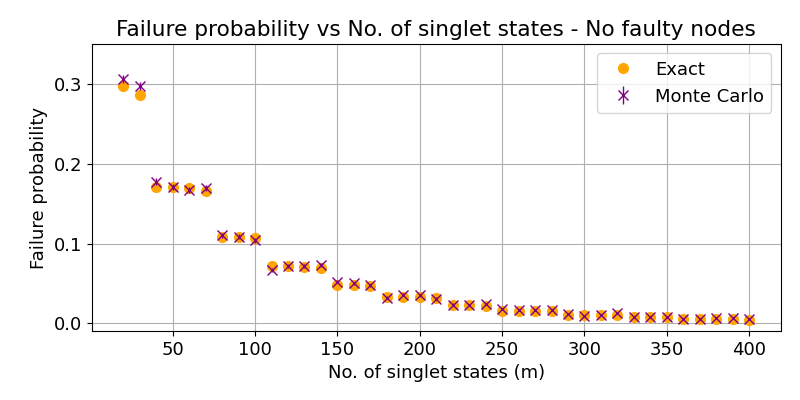
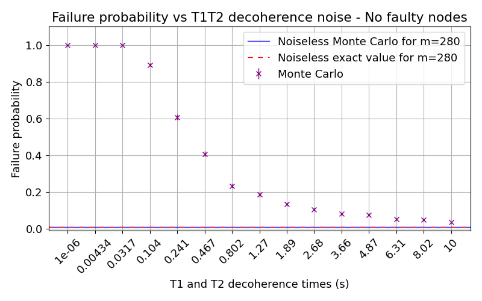
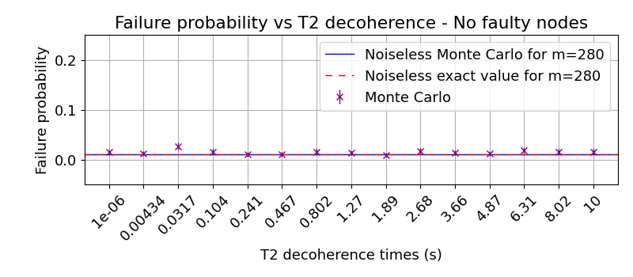

# Noisy Byzantine Agreement Protocol Simulation in a Small Quantum Network: Evaluating the Impact of Memory Decoherence on the Protocol's Failure

This repository contains the files and code for the simulation of a noisy byzantine agreement for the course [CSE3000 Research Project](https://cse3000-research-project.github.io/2025/Q5) (2025, Q4). The project includes simulation code for calculating the failure rate of the quantum Byzantine agreement protocol agreement under three different fault conditions: no faulty nodes, a faulty sender, and a faulty receiver. There are three types of simulations: one noiseless, one with carbon T2 decoherence noise, and one with both carbon T1 and T2 decoherence noise.

This project is based on the research [Resource analysis for quantum-aided Byzantine agreement with the four-qubit singlet state](https://quantum-journal.org/papers/q-2024-04-30-1324/).

## Quick Start


### Prerequisites

* Python 3.8.
* Linux, MacOS, or WSL.

### Setup Steps

1. Clone the repository ```git@github.com:prisha-m/noisy-quantum-byzantine-agreement-protocol.git```.

2. Install the [SquidaASM packages](https://squidasm.readthedocs.io/en/latest/installation.html) (`venv` recommended).


### Example on How to Run

Navigate to one of the three simulation type folders (`noiseless`, `noisyt2`, or `noisyt1t2`), and run
- `python3 rs_nf.py` for the no faulty nodes configuration.
- `python3 rs_sf.py` for the s faulty configuration.
- `python3 rs_rf.py` for the r0 faulty configuration.

To run `plot_t1t2.py` or `plot_t2.py`, run `python3 plot_t1t2.py <faulty>` or `python3 plot_t2.py <faulty>` where `<faulty>` is either `n`, `s`, or `r0` depending on whether you want to plot the results for no faulty, s faulty, or r0 faulty respectively.

---

## Plots

Here are some of the plots that were generated from the simulation output from DelftBlue. Note that these plots were made with >= 500 data samples.





## 📂 Project Structure

```
noisy-quantum-byzantine-agreement-protocol/
├── application/
│   ├── noiseless/                  # Simulation scenario: noiseless conditions
│   │   ├── programs/               # s, r0, r1 node program
│   │   ├── results/
│   │   │   ├── exact data          # Exact noiseless results
│   │   │   └── raw                 # Simulation output data
│   │   ├── config.yaml             # Network configuration
│   │   ├── constants.py            # Constants
│   │   ├── job_nf.sh               # Job submission scripts for runs on DelftBlue
│   │   ├── job_rf.sh               
│   │   └── job_sf.sh               
│   │   ├── program_conditions.py   # Definition of input paramteers
│   │   ├── rs_nf.py                # Runner script for no faulty configuration
│   │   ├── rs_rf.py                # Runner script for r0 faulty configuration
│   │   └── rs_sf.py                # Runner script for s faulty configuration
│
│   ├── noisyt1t2/                  # Simulation scenario: with T1 & T2 noise
│   │   ├── programs/               # s, r0, r1 node program
│   │   ├── results/
│   │   │   ├── exact data          # Exact noiseless results
│   │   │   └── raw/                # Simulation output data
│   │   │       └── plot_t1t2.py      # Scripts to generate plots from results
│   │   ├── config.yaml             # Network configuration
│   │   ├── constants.py            # Constants
│   │   ├── job_nf.sh               # Job submission scripts for runs on DelftBlue
│   │   ├── job_rf.sh               
│   │   └── job_sf.sh               
│   │   ├── program_conditions.py   # Definition of input paramteers
│   │   ├── rs_nf.py                # Runner script for no faulty configuration
│   │   ├── rs_rf.py                # Runner script for r0 faulty configuration
│   │   └── rs_sf.py                # Runner script for s faulty configuration
│
│   ├── noisyt2/                    # Simulation scenario: with T2 noise only
│   │   ├── programs/               # s, r0, r1 node program
│   │   ├── results/
│   │   │   ├── exact data          # Exact noiseless results
│   │   │   └── raw/                # Simulation output data
│   │   │       └── plot_t2.py      # Scripts to generate plots from results
│   │   ├── config.yaml             # Network configuration
│   │   ├── constants.py            # Constants
│   │   ├── job_nf.sh               # Job submission scripts for runs on DelftBlue
│   │   ├── job_rf.sh               
│   │   └── job_sf.sh               
│   │   ├── program_conditions.py   # Definition of input paramteers
│   │   ├── rs_nf.py                # Runner script for no faulty configuration
│   │   ├── rs_rf.py                # Runner script for r0 faulty configuration
│   │   └── rs_sf.py                # Runner script for s faulty configuration
│
├── images                          # Generated images with simulation output
├── .gitignore
└── README.md              
         
```

